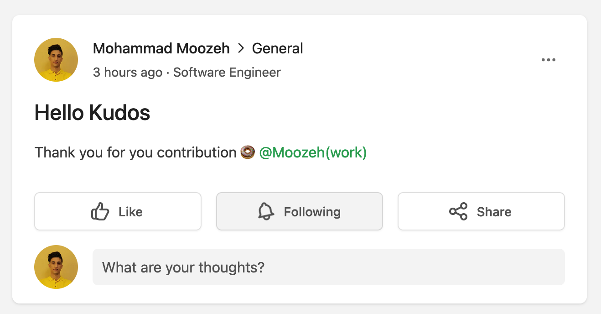

# 🍩 Kudos a Tribe App
Help communities to be stronger with power of appreciation.  
I was part of a community that practices English from around the world. The most notable thing about that group is they were really kind and thankful. So that brings the idea that we can have a tool to improve and gamify this kind of behavior. Now with Kudos, you can give people a donut 🍩 as a “Thank You”. We count them all and then at the end of the month you get the most receivers and givers.

## Give someone Kudos, How?
Just mentioned the person and put a donut near their name.  
`@Mohammad 🍩 Thank you for participation.`  



# Technical stuff
## Installation
```
# Install dependencies
yarn install

# development mode
yarn run start:dev

# Or production mode
yarn build
yarn run start:prod
```

## Tasks
1. [x] Check those videos from Siavash (2 times) and find out what they want!
2. [x] Fork and clone prepared repo from Github
3. [x] Initial and check connectivity
4. [x] Enabling webhooks
5. [x] Read Developer Guide and find out how I can communicate with GraphQL
6. [ ] Describe your idea and how you are going to implement it?
7. [ ] Technical tasks in detail
    1. [x] Get sample data of hooks that you subscribed.
    2. [x] Define DTOs
    3. [ ] [Verifying webhook requests](https://community.tribe.so/devhub/post/webhook-signing-secret-9pS6ddlaCNN6lot)
    4. [x] Data ID check! ignore duplicated messages!
    5. [x] Pass verified data into service - call service method
    6. [x] find out is kudos emoji included or not? Count Kudos in message!
    7. [x] Get List of users in the community.
    8. [x] What kind of data structure you will use for saving data in memory?
    9. [x] Count both receiver and giver.
    10. [x] Add new comer
    11. [x] Create report space
    12. [x] Reset Kudos everyday.
    13. [ ] Monthly leaderboard!
    14. [ ] Unit tests
8. [x] Complete Readme.md
9. [ ] Future features 
   1. [ ] Leaderboard with React SDK
   2. [ ] Custom emoji
   3. [ ] Setting for number of Kudos in a day!
   4. [ ] Persist Data (MongoDB or Redis)
   5. [ ] Different network
   6. [ ] Engagement stuff (bouns.ly, Taco)
10. [x] Follow up [devHub](https://community.tribe.so/member/MSHsBS0JmC)
11. [ ] A video to describe this project
